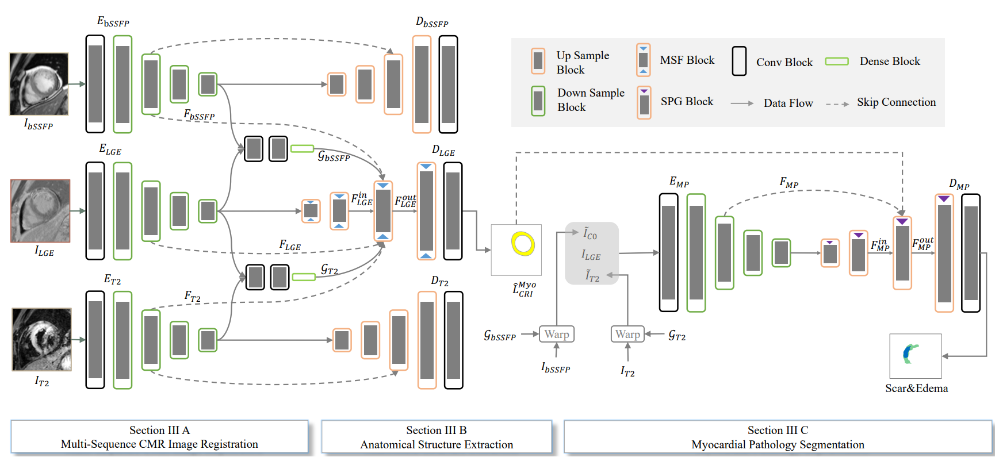
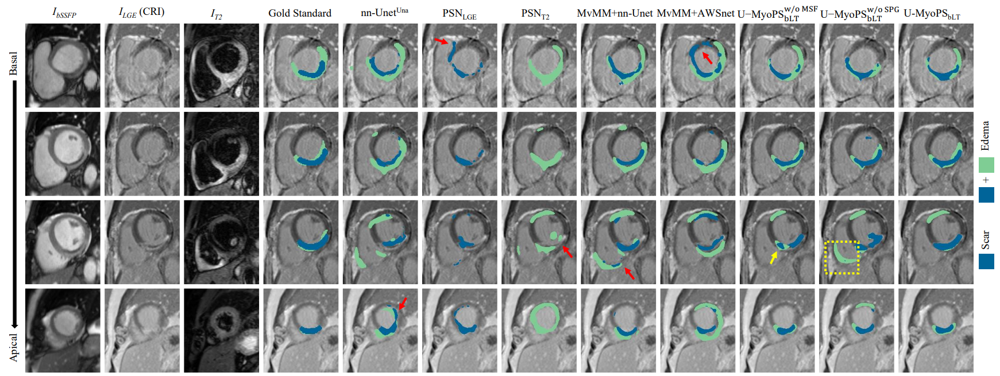

# U-MyoPS
Our manuscript is still under review. Source code will be released once the manusciript is accepted.

# Abstract 
Myocardial pathology segmentation (MyoPS) is critical for the risk stratification and treatment planning of myocardial infarction (MI). 
Multi-sequence cardiac magnetic resonance (CMR) images can provide 
valuable information. For instance, balanced steady-state free precession  cine sequences present clear anatomical boundaries, while late gadolinium enhancement and T2-weighted CMR images visualize myocardial scar and edema of MI, respectively. Existing methods usually fuse anatomical and pathological information from different sequences of CMR images for MyoPS, but assume that these images have been spatially aligned. 
However, multi-sequence CMR images are usually unaligned due to the respiratory motions in clinical practices, which poses additional challenges for  MyoPS. This work presents an automatic MyoPS framework for unaligned multi-sequence CMR images. Specifically, %we first align multi-sequence CMR images into a common space. Then, we design a model for simultaneous image registration and information fusion, which aggregates multi-sequence features into a common space to extract anatomical structures (\ie myocardium). Consequently, we can highlight the informative regions in the common space via the extracted myocardium to improve MyoPS performance, considering the spatial relationship between myocardial pathologies and myocardium. Experiments on a private multi-sequence CMR dataset and a public dataset from the MYOPS2020 challenge show that our framework could achieve promising performance for fully automatic MyoPS.

# implementation details
1. we implemented the joint registration and myocardium segmentation in ./jrs/joint_registration_myocardium_segmentation.py
2. prior-aware sub-network is based on nnUNet framework. We implemented it in ./jrs/pathology_segmentation_train.py ./jrs/pathology_segmentation_test.py ./jrs/pathology_segmentation_eval.py

An overview of proposed method:

Visualization of different MyoPS results:

Visualization of transmurality:

## Acknowledgement
This project is largely based on the "tps_stn_pytorch", "simpleitk", "nnUNet" and "MvMM" repositories.

## Contact
If you have any question or issuse, create a new issue, or directly email me at moon_well@live.cn
